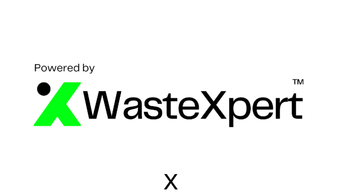
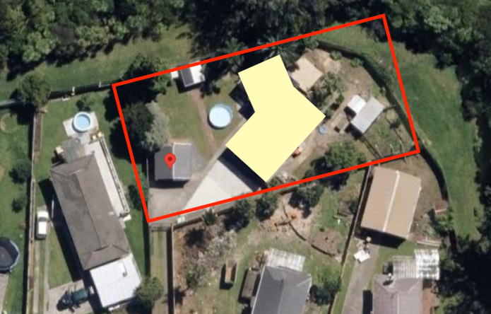

## x

##### ARO Deconstruction Works (JFC x Levela x All

# Site Waste Report

###### for

 11 Camphora Place, Ranui

 11 Camphora Place, Ranui, Auckland 0612, New Zealand

## x

### AUTO-POPULATES SITE INFO

-----

## Contents

###### 1. Objectives & Outline

 2. General Project Information

 3. Brief Project Description

 4. Site Location Map

 5. Recycling Target

 6. Materials Purchases / Waste Forecast

   6.1 Waste Forecast Overview   6.2 Spent Waste Budget

 7. Record Keeping

   7.1 Record Keeping   7.2 Analysis and Data   7.3 Total Waste Summary   7.4 Waste Generation Rates (WGR)   7.5 Estimated CO2 Emissions   7.6 Estimate Costs Associated

 8. Waste Wins for Project

 9. Storage of Waste

 10. Waste Review for the Project

### TEMPLATED CONTENTS TABLE

WasteXpert | Auckland

-----

g | g | p,,,

## 1. Objectives & Outline

###### The design rates and waste management plan for a construction site involves several steps aimed at reducing waste generation, increasing recycling rates, and minimising the environmental impact of construction activities. Below are some key steps and

 Assess the Waste Streams:Estimate the types and quantities of waste that will be generated on the construction site. This estimate will help inform which materials can be recycled, reused, or disposed. The WasteX software produces an automatic forecast based on ordered materials.

 Identify Waste Reduction Strategies:Develop a plan for managing the waste that focuses on source reduction and material reuse. Consider using materials that generate less waste or are recyclable, such as metal, plastic, and wood; better QS take offs so less is ordered; design to sheet/material sizes for less off cuts; talk to manufacturers retaking back their product waste; talk to suppliers re no plastic covers & push back on returning packaging.

 Establishing Recycling Procedures:Identify which materials can be recycled and establish recycling procedures, such as cleaning or stripping. Ensure that all workers are trained on how to separate recyclable from non-recyclable materials. Convey this information & expectations to all subcontractors.

 Assign a Project Waste Manager (PWM):Establishing an internal or external PWM is essential, the PWM audits, communicates, and maintains on-site waste management systems.

 Develop a Waste Management Plan:The WasteX SWMP covers collection, storage, and disposal of waste materials, as well as the site details, targets, site-specific goals, and appropriate disposal partners. The SWMP should include procedures for the handling of hazardous materials such as asbestos and lead-based paint.

 Utilise a Waste Hierarchy for Disposal:Use Waste Collectors that specialise in construction & deconstruction (C&D) materials. Focusing on Waste Collectors that undertake reuse, then recycling, then disposal. Waste Collectors should be able to provide the necessary equipment for collection, transport waste to appropriate recycling or disposal facilities, and provide the data for WasteX tracking.

 Monitor and Evaluate the Plan:Regularly monitor and evaluate the SWMP to ensure that the objectives are being met. The designated Project Waste Manager is responsible for updating the site profile & information.

 Educate Workers and Stakeholders:Educate staff, contractors, and stakeholders on the importance of waste reduction and recycling. Provide training and resources to assist with understanding of the SWMP and clarifying roles and responsibilities in reducing waste onsite.

 By following these guidelines, an effective SWMP can be developed and operated that reduces waste, increases recycling, and minimises environmental impact from construction activities.

### CURRENTLY AUTO-TEMPLATED - WOULD BE GOOD IF WE COULD MAKE EDITABLE

WasteXpert | Auckland

-----

g | g | p,,,

## 2. General Project Information

###### SITE INFORMATION Site name 11 Camphora Place, Ranui Site type Deconstruction
 Site address Site Address
 Build type Construction size Area 85 m2 (m2)
 Estimate Value ($) 50,000
 Expected Start Date 1/7/2024 Expected End Date 19/7/2024
 Building owner: Auckland Council MAIN CONTRACTOR INFORMATION Company Name ARO Deconstruction WorksOther (List) (JFC x Levela x All Heart NZ)
 Email tim.carter@jfcltd.co.nz
 Mobile 21,420,682
 Address 110 Mount Eden Road, Mount Eden, Auckland 1024, New Zealand

### SITE INFO IS FILLED OUT INTO THIS TABLE FOR DETAILS

WasteXpert | Auckland

|2. General Project Information|Col2|Col3|Col4|
|---|---|---|---|
|SITE INFORMATION||||
|Site name|11 Camphora Place, Ranui|Site type|Deconstruction|
|Site address|Site Address|||
|Build type||Construction size Area (m2)|85 m2|
|Estimate Value ($)|50,000|||
|Expected Start Date|1/7/2024|Expected End Date|19/7/2024|
|Building owner: Auckland Council||||
|MAIN CONTRACTOR INFORMATION||||
|Company Name|ARO Deconstruction Works (JFC x Levela x All Heart NZ)|Other (List)||
|Email|tim.carter@jfcltd.co.nz|||
|Mobile|21,420,682|||
|Address|110 Mount Eden Road, Mount Eden, Auckland 1024, New Zealand|||

-----

g | g | p,,,

### PROJECT DESCRIPTION COPYS FROM INFO AND POPULATES - SITE IMAGE & QR CODE AS WELL

## 3. Brief Project Description

###### e.g. This project is to construct 8 new dwellings with 3 carpark spaces within the site with associated earthworks and the creation of impervious surfaces. Typology consists of new three two-storey two bedroom terrace units, one single bedroom two-storey apartments attached to three one-storey split level tenancies. New retaining walls to site boundaries and between split-level apartments along with neighbor fence replacement.

 The 3 carpark spaces are situated in between the units, this will allow for safe turning within the development.

 The landscaping is composed of a mix of fruit trees, native trees, and hedges/shrubs in the common areas. No mowing lawn where possible to maximise outdoor space for the units. All footpaths will be constructed to allow easy access from the carpark to the units, the first three units have direct access through the front entry.

 During the construction period, all site access will be for delivery trucks as well as construction vehicles. Construction traffic and deliveries will be managed by the site manager. The left in left out rule for trucks will apply and the Vehicle & Truck Maneuvering Plan and Traffic Movement Plan will apply. This allows vehicles to turn on-site rather than reverse onto May Road. Contractor carparking is on the rear site at 92 Freeland Ave, this ensures no on-street parking and minimises any impact on surrounding residents.

 Please refer to map below for further information.

## 4. Site Location Map

WasteXpert | Auckland

-----

g | g | p,,,

## 5. Waste Management Team

**5.1 Project Waste Manager (PWM)**

A person from the construction team will be designated as the "Project Waste Manager" for the project. Their role is to
guarantee commitment, operational effectiveness, and accountability during the construction phase of the project.

The duties of the Project Waste Manager include creating and implementing the SWMP; conveying the goals and
purposes of the SWMP to the construction team and co-workers; providing necessary materials, such as labels, to the
Project Waste Manager; and collaborating with the recycling companies who will handle the materials.

The Project Waste Manager’s responsibilities shall include:

Organising Staff training / competency
Monitoring and recording waste loads transported offsite. For each waste load, keep a record of:

Dates
Material Types (main and sub category)
Weights
End Destinations
Waste Collectors
Disposal Cost

Keep a copy of documents, such as landfill gate receipts, photos, educational content.

ARO Deconstruction Works (JFC x Levela x All

**PWM Name:** Alex Hawthorne (Levela Deconstruction) PWM Company: Heart NZ)

**PWM Mobile:** 64276680071 **PWM Email:** alex@leveladeconstruction.co.nz

## 6. Recycling Target

###### e.g. Given the information below and our identified waste potential waste streams, we are aiming at minimum to achieve 80 % on this project at 11 Camphora Place, Ranui, Auckland 0612, New Zealand. The actual diversion was .

 This is a difference of -80 %.

### THE WASTE MANAGEMENT TEAM INFO IS TEMPLATED - DETAILS POPULATE

 RECYCLING TARGET CALCULATES AND FILLS OUT

WasteXpert | Auckland

|PWM Name:|Alex Hawthorne (Levela Deconstruction)|PWM Company:|ARO Deconstruction Works (JFC x Levela x All Heart NZ)|
|---|---|---|---|
|PWM Mobile:|64276680071|PWM Email:|alex@leveladeconstruction.co.nz|

-----

## Material Purchases / Waste Forecast

###### Material Input

**Purchase**

**Arrival Date** **Stage** **Material** **Sub-Material** **Trade Provider**
**Cost (NZD)**

**Purchase**

**Weight (kg)**

**Order**

**Quantity**

**% of**

**Excess**

Strip Out (non
structural)

Strip Out (non
structural)

Structural

Deconstruction

Structural

Deconstruction

Structural

Deconstruction

Structural

Deconstruction

Structural

Deconstruction

Structural

Deconstruction

1/7/2024 Strip Out (non
structural)

Plasterboard Plasterboard

Metals Aluminium

Metals Metals (mixed) e.g.

metal joinery, fittings

Other Waste General Waste

Timber Timber

Timber Treated

Timber Treated

Hazardous waste Insulation Levela

Deconstruction

Other Waste Miscellaneous

Household Fixtures

100 %

1/7/2024 Strip Out (non
structural)

Other Waste Miscellaneous

Household Fixtures

Jacobs Demo, Sale,

West CRC

NZ$0.00 80 kg Insulation - If
clean, Ceiling

only - 85 m2

NZ$0.00 60 kg Ranch or

french style

doors - 1x

slider

100 %

### THIS IS THE MATERIAL PURCHASES TABLE FROM “PLANS”

WasteXpert | Auckland
W: www.wastexpert.co.nz | E: info@wastexpert.co.nz

-----

-----

1/7/2024 Structural

Deconstruction

1/7/2024 Structural

Deconstruction

Timber Treated West CRC, Levela

Yard

Timber Treated West CRC, Levela

Yard

100 %

100 %

1/7/2024 Structural

Deconstruction

24/11/2024 Site Remediation &

Earth Works

Timber Treated West CRC, Levela

Yard

Timber Timber Levela Decon, The

Recreators

NZ$0.00 1,583 kg Framing 
Pine 4x2 and

3x2 - 546 m

NZ$0.00 1,500 kg Timber 
floor joists 
300 m

NZ$0.00 450 kg Timber Roof

and ceiling 
150 m

NZ$0.00 960 kg Fencing 
Timber 1.6m

100 %

100 %

24/11/2024 Structural

Deconstruction

Other Waste General Waste Levela Decon NZ$0.00 2,000 kg General

Contaminate

d Waste

100 %

### THIS IS THE MATERIAL PURCHASES TABLE FROM “PLANS”

WasteXpert | Auckland
W: www.wastexpert.co.nz | E: info@wastexpert.co.nz

-----

###### Waste Forecast 11 Camphora Place, Ranui

**Estimated**

**Waste Value**

**(NZD)**

**Estimated**

**Removal Cost**

**(NZD)**

**Estimated**
**Stage** **Material** **Sub-Material**

**Removal Date**

5/7/2024 Strip Out (non-structural) Other Waste Miscellaneous

Household Fixtures

**Estimated**

**Waste Weight**

**(kg)**

**Method of**

**Removal**

**Estimated**

**Destination**

REUSE

5/7/2024 Strip Out (non-structural) Plasterboard Plasterboard RECYCLE

5/7/2024 Structural Deconstruction Metals Aluminium RECYCLE

5/7/2024 Structural Deconstruction Metals Metals (mixed) e.g.

metal joinery, fittings

REUSE

5/7/2024 Structural Deconstruction Other Waste General Waste LANDFILL

5/7/2024 Structural Deconstruction Timber Timber RECYCLE

5/7/2024 Structural Deconstruction Timber Treated REUSE

5/7/2024 Structural Deconstruction Timber Treated REUSE

Strip Out (non-structural) Hazardous waste Insulation 80 kg NZ$0.00 NZ$0.00 RECYCLE Waitakere Refuse and

Recycling Centre, 50 The

Concourse, Gate 5,

Henderson, Auckland

0610, New Zealand

Strip Out (non-structural) Other Waste Miscellaneous

Household Fixtures

Strip Out (non-structural) Other Waste Miscellaneous

Household Fixtures

Strip Out (non-structural) Other Waste Miscellaneous

Household Fixtures

60 kg NZ$0.00 NZ$0.00 REUSE 7 Drury Street, New

Lynn, North 0600, New

Zealand

270 kg NZ$0.00 NZ$0.00 REUSE 7 Drury Street, New

Lynn, North 0600, New

Zealand

70 kg NZ$0.00 NZ$0.00 REUSE 7 Drury Street, New

Lynn, North 0600, New

Zealand

### THIS IS THE WASTE FORECAST TABLE FROM “PLANS”

WasteXpert | Auckland
W: www.wastexpert.co.nz | E: info@wastexpert.co.nz

-----

Strip Out (non-structural) Plasterboard Plasterboard 1,000 kg NZ$0.00 NZ$650.00 RECYCLE 1 Victoria Street,

Onehunga, Auckland

1061, New Zealand

Strip Out (non-structural) Plastics Others 80 kg NZ$0.00 NZ$0.00 RECYCLE 1 Victoria Street,

Onehunga, Auckland

1061, New Zealand

Strip Out (non-structural) Timber Untreated 1,000 kg NZ$0.00 NZ$0.00 REUSE Waitakere Refuse and

Recycling Centre, 50 The

Concourse, Gate 5,

Henderson, Auckland

0610, New Zealand

Structural Deconstruction Concrete or masonry Fibre Cement

(Cladding)

800 kg NZ$0.00 NZ$0.00 LANDFILL 1 Victoria Street,

Onehunga, Auckland

1061, New Zealand

Structural Deconstruction Metals Aluminium 1,200 kg NZ$0.00 NZ$0.00 RECYCLE 147 Neilson Street,

Onehunga, Auckland

1061, New Zealand

Structural Deconstruction Timber Timber 4,500 kg NZ$0.00 NZ$1,500.00 RECYCLE 1 Victoria Street,

Onehunga, Auckland

1061, New Zealand

Structural Deconstruction Timber Treated 1,583 kg NZ$0.00 NZ$550.00 REUSE Waitakere Refuse and

Recycling Centre, 50 The

Concourse, Gate 5,

Henderson, Auckland

0610, New Zealand

Structural Deconstruction Timber Treated 1,500 kg NZ$0.00 NZ$0.00 REUSE Waitakere Refuse and

Recycling Centre, 50 The

Concourse, Gate 5,

Henderson, Auckland

0610, New Zealand

Structural Deconstruction Timber Treated 450 kg NZ$0.00 NZ$0.00 REUSE Waitakere Refuse and

Recycling Centre, 50 The

Concourse, Gate 5,

Henderson, Auckland

0610, New Zealand

### THIS IS THE WASTE FORECAST TABLE FROM “PLANS”

WasteXpert | Auckland
W: www.wastexpert.co.nz | E: info@wastexpert.co.nz

-----

Site Remediation & Earth

Works

Timber Timber 960 kg NZ$0.00 NZ$0.00 REUSE 7/6 Westgate Drive,

Massey, Auckland 0614,

New Zealand

Structural Deconstruction Other Waste General Waste 2,000 kg NZ$0.00 NZ$800.00 LANDFILL 1 Victoria Street,

Onehunga, Auckland

1061, New Zealand

### THIS IS THE WASTE FORECAST TABLE FROM “PLANS”

WasteXpert | Auckland
W: www.wastexpert.co.nz | E: info@wastexpert.co.nz

-----

###### 7.1 Waste Forecast Overview

This overview provides the total estimated waste breakdown (recorded in kgs) of each waste stream.

|Material|Total Estimated Weight (kgs)|Total Estimated Value (NZD)|Estimated Total Removal Cost (NZD)|
|---|---|---|---|
|Carpet||||
|Concrete or Masonry|800 kg|NZ$0.00|NZ$0.00|
|Glass||||
|Hazardous Waste|80 kg|NZ$0.00|NZ$0.00|
|Metals|1,200 kg|NZ$0.00|NZ$0.00|
|Other Waste|2,400 kg|NZ$0.00|NZ$800.00|
|Plasterboard|1,000 kg|NZ$0.00|NZ$650.00|
|Plastics|80 kg|NZ$0.00|NZ$0.00|
|Timber|9,993 kg|NZ$0.00|NZ$2,050.00|

### THE SUMMARY DATA FOR THE WASTE FORECAST FROM “PLANS”

**WasteXpert Ltd | Auckland**

-----

##### 8. Waste Record Keeping

Keeping accurate records of waste management activities is essential for ensuring compliance with regulations and monitoring progress towards waste reduction goals.
The waste management team must maintain records of all waste materials leaving the site for reuse, recycling, recovery, or disposal.

All necessary documentation requirements must be fulfilled before material transfer, and records must be cross-checked with removal dockets to ensure that all waste
removed from the site has been accounted for and accepted at end destinations.

The WasteX Software safely stores and maintains records of waste removal from sites. This data has a user ID attached to each entry to ensure transparency
and authenticity of all information.

###### 8.1 Waste Record

|Removal Date|Col2|Stage|Material|Col5|Sub-Material|Col7|Weight (kgs)|Col9|Aproximate Waste Value (NZD)|Col11|Removal Cost (NZD)|Col13|Method of Removal|Col15|Waste Collector Name|Col17|Data Logged by Name|Col19|Col20|Col21|
|---|---|---|---|---|---|---|---|---|---|---|---|---|---|---|---|---|---|---|---|---|
|5/7/2024|Structural Deconstruction|||Metals||Aluminium||1,496 kg||NZ$0.00||NZ$0.00||RECYCLE||Endless Metals||Logan Soole|||
|5/7/2024|Structural Deconstruction|||Metals||Metals (mixed) e.g. metal joinery, fittings||682 kg||NZ$0.00||NZ$0.00||REUSE||Levela Deconstruction (COMMUNITY REUSE)||Logan Soole|||
|5/7/2024|Strip Out (non-structural)|||Other Waste||Miscellaneous Household Fixtures||1,140 kg||NZ$0.00||NZ$0.00||REUSE||Levela Deconstruction (COMMUNITY REUSE)||Logan Soole|||
|5/7/2024|Structural Deconstruction|||Other Waste||General Waste||4,060 kg||NZ$0.00||NZ$0.00||LANDFILL||Green Gorilla||Logan Soole|||
|5/7/2024|Strip Out (non-structural)|||Plasterboard||Plasterboard||1,600 kg||NZ$0.00||NZ$0.00||RECYCLE||Green Gorilla||Logan Soole|||
|5/7/2024|Structural Deconstruction|||Timber||Timber||5,140 kg||NZ$0.00||NZ$0.00||RECYCLE||Green Gorilla||Logan Soole|||
|5/7/2024|Structural Deconstruction|||Timber||Treated||1,200 kg||NZ$0.00||NZ$0.00||REUSE||Levela Deconstruction (COMMUNITY REUSE)||Logan Soole|||
|5/7/2024|Structural Deconstruction|||Timber||Treated||6,000 kg||NZ$0.00||NZ$0.00||REUSE||Tipping Point CRC||Logan Soole|||

### THE WASTE RECORD TABLE DATA FROM THE “RECORDS”

**W** **X** **L d | A** **kl** **d**

-----

###### 8.2 Total Waste Summary

This overview provides the total approximate waste breakdown (recorded in kgs) of each waste stream.

**Total**

**Material** **Estimated Weight**

**(kgs)**

**Carpet**

**Concrete or Masonry** 800 kg

**Glass**

**Hazardous Waste** 80 kg

**Metals** 1,200 kg

**Other Waste** 2,400 kg

**Plasterboard** 1,000 kg

**Plastics** 80 kg

**Timber** 9,993 kg

###### 8.3 Total Removal Summary

This overview provides the total approximate waste breakdown (recorded in kgs) of each waste stream.

|Material|Total Estimated Weight (kgs)|Total Actual Weight (kgs)|Difference or Reduction (kgs)|
|---|---|---|---|
|Carpet|||0 kg|
|Concrete or Masonry|800 kg||800 kg|
|Glass|||0 kg|
|Hazardous Waste|80 kg||80 kg|
|Metals|1,200 kg|2,178 kg|-978 kg|
|Other Waste|2,400 kg|5,200 kg|-2,800 kg|
|Plasterboard|1,000 kg|1,600 kg|-600 kg|
|Plastics|80 kg||80 kg|
|Timber|9,993 kg|12,340 kg|-2,347 kg|

|Material|Total Estimated Weight (kgs)|Total Actual Weight (kgs)|Difference or Reduction (kgs)|
|---|---|---|---|
|Landfill|2,800 kg|4,060 kg|-1,260 kg|
|Cleanfill|||0 kg|
|Recycle|6,860 kg|8,236 kg|-1,376 kg|
|Reuse|5,893 kg|9,022 kg|-3,129 kg|

### THE SUMMARY DATA FOR WASTE REMOVAL vs FORECAST

**W** **X** **L d | A** **kl** **d**

### FOR WASTE STREAMS & REMOVAL METHOD

-----

###### 8.4 Waste Generation Rates (WGR)

The Waste Generation Rates determine the quantity of waste the project is generating against the area of the project (this varies for height and floors).

|Material|Average Waste Generation Rate (kg/sqm)|
|---|---|
|Carpet||
|Concrete or Masonry||
|Glass||
|Hazardous Waste||
|Metals|13 kg/sqm|
|Other Waste|30.5 kg/sqm|
|Plasterboard|19 kg/sqm|
|Plastics||
|Timber|145 kg/sqm|

### WASTE GENERATION RATES DATA

**W** **X** **L d | A** **kl** **d**

-----

###### 8.5 Approximate Costs Associated

 Removal Costs

**Total Estimated** **Total Removal** **Total Saving or Loss**
**Material**

**Removal Cost (NZD)** **Cost (NZD)** **on Removal (NZD)**

**Carpet** NZ$0.00

**Concrete or Masonry** NZ$0.00 NZ$0.00

**Glass** NZ$0.00

**Hazardous Waste** NZ$0.00 NZ$0.00

**Metals** NZ$0.00 NZ$0.00 NZ$0.00

**Other Waste** NZ$800.00 NZ$0.00 NZ$800.00

**Plasterboard** NZ$650.00 NZ$0.00 NZ$650.00

**Plastics** NZ$0.00 NZ$0.00

**Timber** NZ$2,050.00 NZ$0.00 NZ$2,050.00

###### Estimated Waste Value

**Total Estimated** **Total Approximate**
**Material**

**Waste Value (NZD)** **Waste Value (NZD)**

**Carpet**

**Concrete or Masonry** NZ$0.00

**Glass**

**Hazardous Waste** NZ$0.00

**Metals** NZ$0.00 NZ$0.00

**Other Waste** NZ$0.00

**Plasterboard** NZ$0.00

**Plastics** NZ$0.00 NZ$0.00

**Timber** NZ$0.00 NZ$0.00

**The project at 11 Camphora Place, Ranui, Auckland 0612, New Zealand has removed approximately NZ$3,500.00, at a cost of**
**NZ$0.00.**

**The project at 11 Camphora Place, Ranui, Auckland 0612, New Zealand has saved/lost NZ$3,500.00 on removal.**

### COST SUMMARY FOR REMOVAL & VALUE
**W** **X** **L d | A** **kl** **d**

|Col1|Removal Costs|Col3|Col4|
|---|---|---|---|
|Material|Total Estimated Removal Cost (NZD)|Total Removal Cost (NZD)|Total Saving or Loss on Removal (NZD)|
|Carpet|||NZ$0.00|
|Concrete or Masonry|NZ$0.00||NZ$0.00|
|Glass|||NZ$0.00|
|Hazardous Waste|NZ$0.00||NZ$0.00|
|Metals|NZ$0.00|NZ$0.00|NZ$0.00|
|Other Waste|NZ$800.00|NZ$0.00|NZ$800.00|
|Plasterboard|NZ$650.00|NZ$0.00|NZ$650.00|
|Plastics|NZ$0.00||NZ$0.00|
|Timber|NZ$2,050.00|NZ$0.00|NZ$2,050.00|

|Col1|Estimated Waste Value|Col3|
|---|---|---|
|Material|Total Estimated Waste Value (NZD)|Total Approximate Waste Value (NZD)|
|Carpet|||
|Concrete or Masonry|NZ$0.00||
|Glass|||
|Hazardous Waste|NZ$0.00||
|Metals|NZ$0.00|NZ$0.00|
|Other Waste|NZ$0.00||
|Plasterboard|NZ$0.00||
|Plastics|NZ$0.00|NZ$0.00|
|Timber|NZ$0.00|NZ$0.00|

-----

g |

## Waste Station Checklist

|ITEM|DESCRIPTION|COMPLETED|COMMENTS|
|---|---|---|---|
|Location|Location of waste station is clearly identified on the site plan provided, Appendix 7|Completed||
|Containers|Adequate container volumes have been provided for each waste type, based on estimated volumes generated|Completed||
|Signage|Containers are clearly labelled for each waste type. Clear signage has been placed at the waste station, giving details of the SWMP, including the different waste types that are accepted|Completed||
|Access|Waste station is easily accessible for all workers and provides adequate space to allow staff to safely move around|Completed||
|Training|Appropriate training has been provided to all workers on the waste station, including sorting and separation, and hazardous waste disposal|Completed||
|Maintenance|Regular cleaning and upkeep of the waste station is being conducted to prevent contamination and adherence to local regulations|Completed||
|Monitoring|Regular monitoring is undertaken to ensure that waste is separated into appropriate bins.|Completed||
|Reporting|Accurate records are maintained, tracking amounts and types of waste generated, in line with requirements of the SWMP|Completed||
|Review|Review/update SWMP periodically to ensure waste station details are efficient and effective|Completed||

### TABLE FOR PLANNING

 CHECKLIST

WasteXpert | Auckland

-----

#### 10. Waste Review for

|DESCRIPTION|COMMENTS|
|---|---|
|STRENGTHS in reducing and managing waste throughout the project:|Project Separation was good|
|CHALLENGES and LESSONS LEARNED in reducing and managing waste on this project:|Homing some of the timber was difficult.|
|LIST any goals in the original Waste Reduction Plan that weren’t met and EXPLAIN why:|N/A|
|ACTIONS FOR FUTURE PROJECTS that would further reduce waste:|Utilise more of the CRC network.|
|Any other comments or needs regarding future waste reduction:||
|Add your own Review Comments:||

### REVIEWS TABLE

-----

